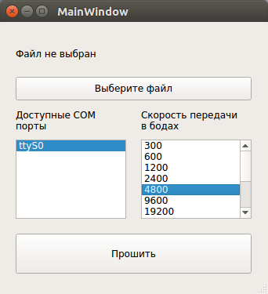

## Загрузчик файлов в микроконтроллер

Task:

1. [x] Конвертирование Intel hex в bin файл. `python`
2. Отправка тестовых данных для проверки работы с портом 
3. [x] Выбор COM порта для прошивки. `python`
3. [x] Выбор битрейта для COM порта. `python`
4. Возможность отправки как bin так и hex файла.
5. [x] Форма для удобной загрузки 
6. Проверчная сумма для отправленного файла.
``
